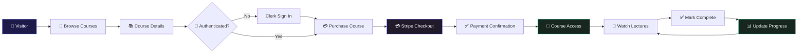
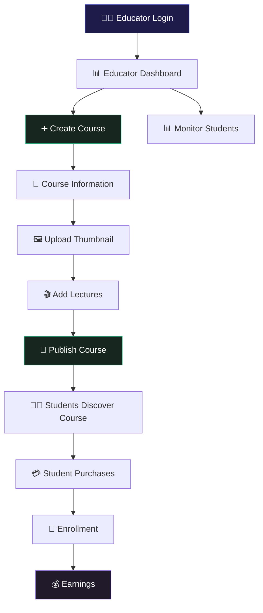
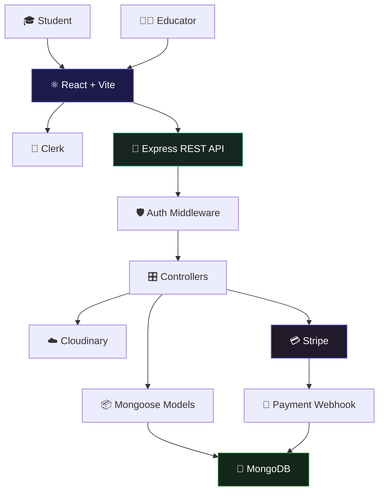

<div align="center">


### 🎓 A Full-Stack Learning Management System

**EDEMY** is a modern LMS where students can discover and purchase courses, learn through structured content, track their progress, while educators can create courses and manage their learning business.

<br>

[](https://react.dev/)
[](https://vite.dev/)
[](https://nodejs.org/)
[](https://expressjs.com/)
[](https://www.mongodb.com/)
[](https://clerk.com/)
[](https://stripe.com/)
[](https://cloudinary.com/)

<br>

**[🌐 Live Demo](https://lms-frontend-steel-six.vercel.app/)**   •  
**[💻 Source Code](https://github.com/Sahoo999/Lms-website)**

<br>

⭐ **If you find this project useful or interesting, consider giving it a star!**

</div>

<br>

---

## 🚀 What is LearnSphere?

Learning platforms usually have two completely different sides:

**Students want to discover → purchase → learn → track progress.**

**Educators want to create → publish → manage → analyze.**

LearnSphere connects both workflows into one full-stack platform.

<table>
<tr>
<td width="50%" valign="top">

### 👨‍🎓 For Students

* 🔎 Discover available courses
* 📖 View detailed course information
* 💳 Purchase courses securely
* 🎥 Access course lectures
* ✅ Track completed lectures
* 📊 Monitor learning progress
* ⭐ Rate purchased courses

</td>

<td width="50%" valign="top">

### 👨‍🏫 For Educators

* ➕ Create courses
* 📝 Add course descriptions
* 🎬 Manage lectures
* 🖼️ Upload course media
* 👥 View enrolled students
* 💰 Monitor course earnings
* 📊 Manage published courses

</td>
</tr>
</table>

<br>

---

## ✨ Why This Project Stands Out

<table>
<tr>
<td width="50%" valign="top">

### 🔐 Production-Style Authentication

Authentication is handled using **Clerk**, providing secure identity management while the backend verifies authenticated requests and educator access.

</td>

<td width="50%" valign="top">

### 💳 Real Payment Architecture

Course purchases use **Stripe Checkout**, with payment information connected back to the LMS through backend purchase records and webhook processing.

</td>
</tr>

<tr>
<td width="50%" valign="top">

### ☁️ Cloud-Based Media

Course thumbnails and media assets are managed through **Cloudinary**, keeping large media files outside the application server.

</td>

<td width="50%" valign="top">

### 📈 Persistent Learning Progress

Completed lectures are stored against the user's course progress, allowing students to continue their learning journey across sessions.

</td>
</tr>

<tr>
<td width="50%" valign="top">

### 🧩 Role-Based Architecture

Student and educator workflows are separated across frontend pages, components, backend routes, controllers, and authorization middleware.

</td>

<td width="50%" valign="top">

### ⚡ Modern React Stack

The frontend uses **React + Vite + Tailwind CSS**, while the backend follows a modular **Express + MongoDB** architecture.

</td>
</tr>
</table>

<br>

---

# 🔄 Complete User Workflow

The easiest way to understand LearnSphere is to follow what actually happens inside the platform.



### 🎓 Student Journey

```text
Discover Course
      ↓
View Course Details
      ↓
Sign In / Register
      ↓
Purchase Through Stripe
      ↓
Payment Verification
      ↓
Course Enrollment
      ↓
Access Lectures
      ↓
Watch & Complete Lessons
      ↓
Progress Saved
      ↓
Continue Learning
```

The important part is that the platform doesn't simply display a course after payment.

**Authentication → payment → purchase record → course access → progress tracking**

forms the complete learning lifecycle.

<br>

---

# 👨‍🏫 Educator Workflow

Educators have a separate workflow designed around creating and managing educational content.



### Educator Lifecycle

**Create → Configure → Upload → Publish → Enroll → Earn → Manage**

This makes LearnSphere more than a course viewer—it acts as a lightweight platform for educators to manage their course business.

<br>

---

# 🏗️ System Architecture



### Architecture Responsibilities

| Layer            | Responsibility                       |
| :--------------- | :----------------------------------- |
| **React + Vite** | User interface and application state |
| **Clerk**        | Authentication and identity          |
| **Express**      | REST API and server-side logic       |
| **Middleware**   | Authentication & authorization       |
| **Controllers**  | Business logic                       |
| **MongoDB**      | Users, courses, purchases & progress |
| **Cloudinary**   | Course/media assets                  |
| **Stripe**       | Course payments                      |
| **Webhooks**     | Payment synchronization              |

<br>

---

# 🛠️ Tech Stack

<div align="center">

| Layer              | Technology          |
| :----------------- | :------------------ |
| **Frontend**       | React 19 · Vite     |
| **UI**             | Tailwind CSS        |
| **Routing**        | React Router        |
| **Authentication** | Clerk               |
| **Backend**        | Node.js · Express 5 |
| **Database**       | MongoDB · Mongoose  |
| **Payments**       | Stripe              |
| **Media**          | Cloudinary          |
| **HTTP**           | Axios               |
| **Rich Text**      | Quill               |
| **Video**          | React YouTube       |
| **Deployment**     | Vercel              |

</div>

<br>

---

# 📁 Project Structure

```text
Lms-website/
│
├── client/
│   ├── src/
│   │   ├── components/
│   │   │   ├── educator/
│   │   │   └── student/
│   │   │
│   │   ├── pages/
│   │   │   ├── educator/
│   │   │   └── student/
│   │   │
│   │   ├── context/
│   │   ├── assets/
│   │   └── App.jsx
│   │
│   ├── package.json
│   └── vite.config.js
│
├── server/
│   ├── configs/
│   ├── controllers/
│   ├── middlewares/
│   ├── models/
│   ├── routes/
│   ├── api/
│   ├── server.js
│   └── package.json
│
└── README.md
```

<br>

---

# 🚀 Run Locally

### 1. Clone

```bash
git clone https://github.com/Sahoo999/Lms-website.git
cd Lms-website
```

### 2. Backend

```bash
cd server
npm install
npm run server
```

### 3. Frontend

Open another terminal:

```bash
cd client
npm install
npm run dev
```

Configure the required environment variables for:

```text
MongoDB
Clerk
Cloudinary
Stripe
Frontend API URL
```

Then open the Vite development URL shown in your terminal.

<br>

---

# 🔐 Security & Data Flow

LearnSphere separates authentication, business logic, data persistence, and third-party services.

```text
User
 │
 ▼
Clerk Authentication
 │
 ▼
Authenticated Frontend Request
 │
 ▼
Express API
 │
 ▼
Authentication Middleware
 │
 ▼
Controller
 │
 ├── MongoDB
 ├── Cloudinary
 └── Stripe
```

This separation keeps the frontend focused on presentation while sensitive business operations remain on the server.

<br>

---

# 💡 Engineering Decisions

<details>
<summary><b>Why React + Vite?</b></summary>
<br>

Vite provides a fast development environment and optimized production builds, while React makes the application easy to organize into reusable student and educator components.

</details>

<details>
<summary><b>Why MongoDB?</b></summary>
<br>

Courses, users, purchases, lectures, and progress naturally map to document-based data structures. Mongoose adds schema modeling and validation on top of MongoDB.

</details>

<details>
<summary><b>Why Stripe Checkout?</b></summary>
<br>

Payment processing is delegated to Stripe instead of handling sensitive payment information directly inside the application. The LMS then synchronizes successful purchases through its backend flow.

</details>

<details>
<summary><b>Why Cloudinary?</b></summary>
<br>

Educational platforms deal with images and media. Cloudinary provides dedicated cloud storage and delivery rather than forcing the application server to manage large media assets.

</details>

<details>
<summary><b>Why separate student and educator interfaces?</b></summary>
<br>

Their goals are fundamentally different. Students need discovery and learning tools, while educators need publishing, management, enrollment, and earnings tools. Separate flows keep both experiences focused.

</details>

<br>

---

# 📌 Key Capabilities

```text
✅ User Authentication
✅ Student Dashboard
✅ Educator Dashboard
✅ Course Discovery
✅ Course Details
✅ Course Creation
✅ Lecture Management
✅ Course Publishing
✅ Secure Payments
✅ Purchase Management
✅ Student Enrollment
✅ Lecture Progress Tracking
✅ Course Ratings
✅ Educator Earnings
✅ Cloud Media Storage
```

<br>

---

# 🔮 Future Improvements

Some areas that could take LearnSphere even further:

* 💬 Course discussions & comments
* 🏆 Certificates & achievements
* 🔔 Notifications
* 🔍 Advanced course search & filtering
* ❤️ Course wishlist
* 📱 PWA / mobile experience
* 📊 Deeper educator analytics
* 🎯 Personalized course recommendations
* 🧠 AI-powered learning assistant

<br>

---

# ⭐ Support the Project

If you found **LearnSphere** useful, educational, or interesting:

### ⭐ Star the repository

A star helps the project get discovered and motivates further development.

**[⭐ Star LearnSphere on GitHub](https://github.com/Sahoo999/Lms-website)**

You can also fork it, experiment with the architecture, and build your own LMS features on top of it.

<br>

---

<div align="center">


### 🎓 LearnSphere LMS

**Learn. Teach. Grow.**

[🌐 Live Demo](https://lms-frontend-steel-six.vercel.app/) ·
[💻 GitHub](https://github.com/Sahoo999/Lms-website)

**Built with ❤️ using React, Node.js, MongoDB, Clerk, Stripe & Cloudinary**

</div>
